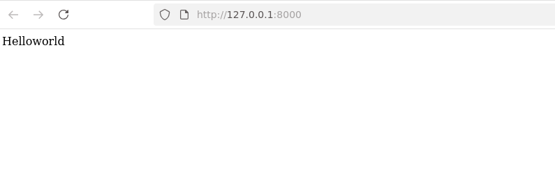

# Fase1

Primeiros vamos criar instalar o componentes para fazer o projeto em Djanto  
- 1ª Instale o python - Passo em maquinas Microsoft Window / MacOS
- 2ª Em maquinas Linux vamos utilizar um ambiente virtual para instalar os pacotes  
```shell
python3 -m venv /tmp/ambientevirtual
source /tmp/ambientevirtual/bin/activate
```

- 3ª Instale agora o Django no seu ambiente  
```shell
pip install django==5.2  
```
- 4ª Crie um projeto django chamado aulatoptic  
django-admin startproject projeto /tmp/aulatoptic/  
- 5ª Teste o servidor  
```shell
cd /tmp/aulatoptic  
python manage.py runserver  
```   
Acesse o servidor no navegador por http://127.0.0.1:8000/


# Fase2

Agora precisamos criar uma aplicação dentro do nosso projeto e como teste fazer um tradicional HelloWorld.  
- 1ª Vamos criar a aplicação chamada meuapp dentro do projeto. Para isso execute o comando abaixo.  
```shell
python manage.py startapp meuapp
```   
Agora precimos configurar o projeto Django para que ele reconheça a aplicação que acabamos de fazer.  Então sera necessario criar alguns arquivos e modificar outros  

- 2ª Altere o arquivo settings.py localizado na pasta projeto.   
```python
INSTALLED_APPS = [
    'meuapp.apps.MeuappConfig',
    'django.contrib.admin',
    'django.contrib.auth',
    'django.contrib.contenttypes',
    'django.contrib.sessions',
    'django.contrib.messages',
    'django.contrib.staticfiles',
]
```
- 3ª Vamos criar a função hello em view.py, na pasta meuapp, para retorna a 'Helloworld' desta fase. Esta mensagem vai usar um objeto do tipo HttpResponse, objeto usado no Django em resposta requisições Http. 
```python
from django.shortcuts import render
from django.http import HttpResponse

ef hello(request):
    return HttpResponse("Helloworld")
```
- 4ª Crie uma arquivo urls.py na pasta meuapp, ele vai ter uma lista chamada de urlspatterns para administrar as rotas requisitas com um função do arquivo views.py. Note que a variável 'name' é usada para dar apelidos estas rotas.
```python
from django.urls import path
from . import views
urlpatterns = [
    path('', views.hello, name="helloview"),
]
``` 

- 5ª Configure o arquivo urls.py na pasta projeto para que ele conheça utilize o meuapp em uma rota desejada. 

```python
from django.contrib import admin
from django.urls import path, include

urlpatterns = [
    path('',include('meuapp.urls') ),
    path('admin/', admin.site.urls),
]
```

Novamente acessando pelo navegador o endereço http://127.0.0.1:8000/



# Fase3

Agora vamos testar o gerenciamento de rotas utilizando parametros na rotas para passar parar views.  
Neste sentido vamos criar funções no arquio views.py e usar estar funções no arquivo urls.py. 
- 1ª Vamos criar funções matemática no arquivo views.py que calculem soma e potencia.  
```shell
def soma(request, num1 , num2):
    return HttpResponse(f" A soma de {num1} mais {num2} é {num1 + num2}")
def potencia(request, base , expoente):
    return HttpResponse(f" A potencia com base {base} e expoente {expoente} é {base ** expoente}")
def potencia10(request,  expoente):
    return HttpResponse(f" A potencia com base 10 e expoente {expoente} é {10 ** expoente}")
```   
- 2ª Ajustamos o arquio urls.py para capturar arguumentos nos parametros da rotas.   
```shell
urlpatterns = [
    path('', views.hello, name="helloview"),
    path('soma/<int:num1>/<int:num2>', views.soma, name="somaview"),
    path('potencia/<int:base>/<int:expoente>', views.potencia, name="potenciaview"),
    path('potencia/<int:expoente>', views.potencia10, name="potencia10view"),
]
``` 

Vamos testar a aplicação com calculos de soma e potência.  

soma 1 + 1 http://127.0.0.1:8000/soma/1/1  
 

potencia com base 2 e expoente 3
http://127.0.0.1:8000/potencia/2/3


potencia com base 10 e expoente 5
http://127.0.0.1:8000/potencia/5


