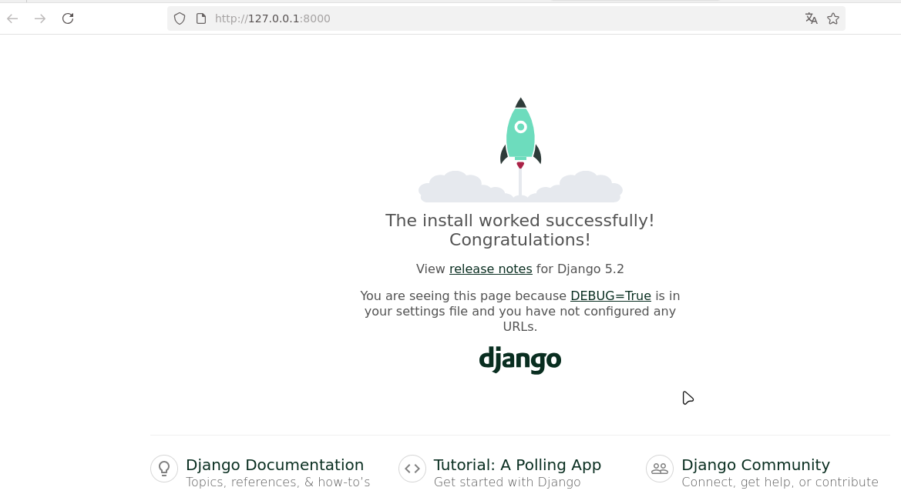

# Fase1

Primeiros vamos criar instalar o componentes para fazer o projeto em Djanto  
- 1ª Instale o python - Passo em maquinas Microsoft Window / MacOS
- 2ª Em maquinas Linux vamos utilizar um ambiente virtual para instalar os pacotes  
```shell
python3 -m venv /tmp/ambientevirtual
```
source /tmp/ambientevirtual/bin/activate
- 3ª Instale agora o Django no seu ambiente  
```shell
pip install django==5.2  
```
- 4ª Crie um projeto django chamado aulatoptic  
django-admin startproject projeto /tmp/aulatoptic/  
- 5ª Teste o servidor  
```shell
cd /tmp/aulatoptic  
python manage.py runserver  
```   
Acesse o servidor no navegador por http://127.0.0.1:8000/


