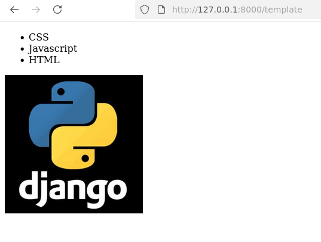

# Fase4

Agora vamos configurar criar um pagina com o básico de uma template
- 1ª Vamos criar dentro da pasta meuapp uma pasta chamada templates e outra chamada de static. Dentro da pasta template que o django procura os arquivos de templates para gerar html de forma dinamica. 
Dentro da pasta static fica os arquivo media como CSS, JS, imagens e outros.

- 1ª Vamos gerar o uma função na views.py para testar os dados, apenas enviar dados para o template.

```python
def meutemplate(request):
    titulo ="Pagina teste template"
    lista = ["CSS", "Javascript", "HTML"]
    return render(request, "exemplo/index.html", {"lista":lista,"titulo":titulo})
```   
- 2ª Vamos adicionar a entrada URL no arquivo urls.py.  
```python
urlpatterns = [
    path('', views.hello, name="helloview"),
    path('soma/<int:num1>/<int:num2>', views.soma, name="somaview"),
    path('potencia/<int:base>/<int:expoente>', views.potencia, name="potenciaview"),
    path('potencia/<int:expoente>', views.potencia10, name="potencia10view"),
    path('template', views.meutemplate, name="templateview"),
]
```   

- 2ª O exemplo de um arquivo template
```html
<!DOCTYPE html>
<html lang="en">
<head>
    <meta charset="UTF-8">
    <meta name="viewport" content="width=device-width, initial-scale=1.0">
     
    <link rel="stylesheet" href="">
    <title>{{titulo}}</title>
    <script src=""></script>
</head>
<body>
    <div class="content">
        <ul>
        
            <li>{{item}}</li>
        
        </ul>
        
    </div>
</body>
</html>
```   

Resultado  
