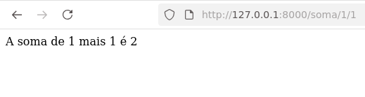

# Fase3

Agora vamos testar o gerenciamento de rotas utilizando parametros na rotas para passar parar views.  
Neste sentido vamos criar funções no arquio views.py e usar estar funções no arquivo urls.py. 
- 1ª Vamos criar funções matemática no arquivo views.py que calculem soma e potencia.  
```shell
def soma(request, num1 , num2):
    return HttpResponse(f" A soma de {num1} mais {num2} é {num1 + num2}")
def potencia(request, base , expoente):
    return HttpResponse(f" A potencia com base {base} e expoente {expoente} é {base ** expoente}")
def potencia10(request,  expoente):
    return HttpResponse(f" A potencia com base 10 e expoente {expoente} é {10 ** expoente}")
```   
- 2ª Ajustamos o arquio urls.py para capturar arguumentos nos parametros da rotas.   
```shell
urlpatterns = [
    path('', views.hello, name="helloview"),
    path('soma/<int:num1>/<int:num2>', views.soma, name="somaview"),
    path('potencia/<int:base>/<int:expoente>', views.potencia, name="potenciaview"),
    path('potencia/<int:expoente>', views.potencia10, name="potencia10view"),
]
``` 

Vamos testar a aplicação com calculos de soma e potência.  

soma 1 + 1 http://127.0.0.1:8000/soma/1/1  
 

potencia com base 2 e expoente 3
http://127.0.0.1:8000/potencia/2/3


potencia com base 10 e expoente 5
http://127.0.0.1:8000/potencia/5
